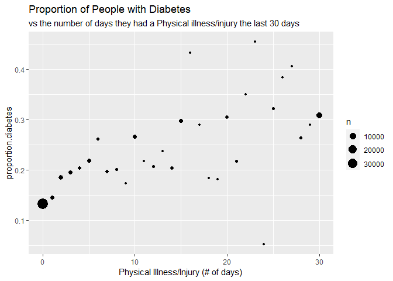
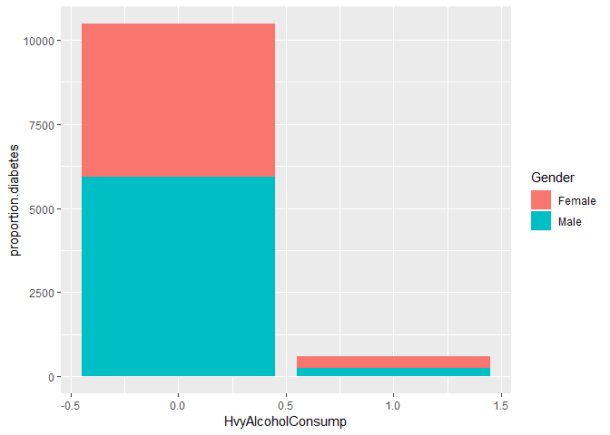
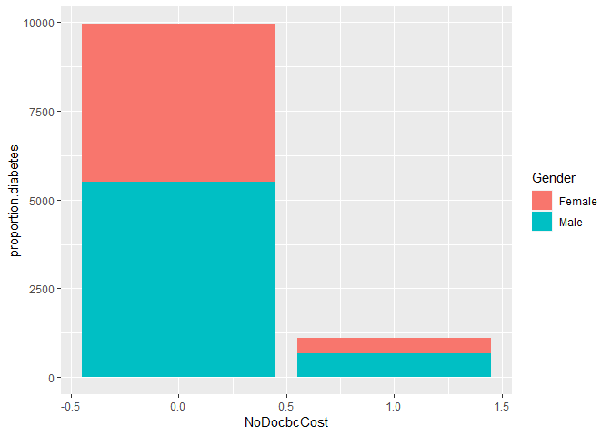
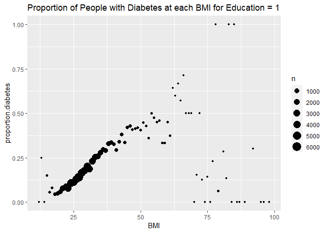
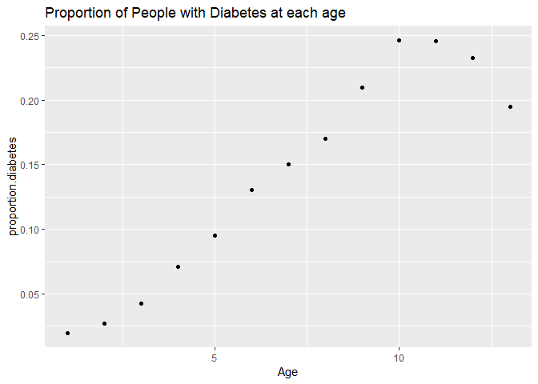
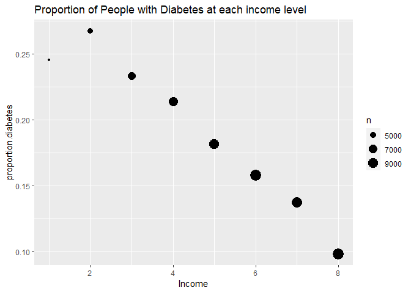

Project 3
================
Rachel Fellman & Sabrina Dahl

- [Introduction](#introduction)
- [Data](#data)
- [Summarizations](#summarizations)
- [Modeling](#modeling)
  - [Log Loss](#log-loss)
  - [Logistic Regression](#logistic-regression)
  - [Lasso](#lasso)
  - [Classification Trees](#classification-trees)
  - [Random Forest Models](#random-forest-models)
  - [Logistic Model Tree](#logistic-model-tree)
  - [Partial Least Squares Model](#partial-least-squares-model)
- [Final Model Selection](#final-model-selection)

# Introduction

The “diabetes” dataset (as read in below) consists of 253,680 responses
to 21 variables of the Behavioral Risk Factor Surveillance System survey
conducted by the CDC in 2015. We will be focusing on the Diabetes_binary
as our response variable where 0 indicates no diabetes, and 1 indicates
either prediabetes or diabetes.  
We will be exploring how Body Mass Index (BMI), Age, Income, healthcare
(AnyHealthcare), and Mental Health (MentHlth) affects our response
variable and any trends between them. Age is scaled from 1-13 (1=18-24,
9=60-64, and 13= 80 or older). Income is scaled from 1-8 (1 is less than
10,000 dollars, 5 less than 35,000, and 8 is 75,000 or more). Healthcare
is an indication of whether they have any form of healthcare with 0 is
no and 1 is yes. Mental Health is the days of poor mental health on a
scale from 1-30.  
We will also be exploring the HvyAlcoholConsump, Sex, NoDocbcCost, and
PhysHlth variables. Heavy Alcohol Consumption would be greater than or
equal to 14 drinks a week for a man and greater than or equal to seven
drinks for a woman with 0 indicating no, and 1 indicating yes. For Sex,
0 indicates female and 1 indicates male. NoDocbcCost indicates whether
the individual needed to go to the doctor at any time in the past 12
months but did not go because of cost with 0 being no and 1 being yes.
PhysHlth is the days with physical illness or injury in the past 30 days
on a scale from 1-30.  
Exploratory Data Analysis (EDA) is important to ensure we understand the
data so results are created with intent. Checking for missing data and
outliers is important so that any skew to the data can be avoided, and
potentially different approaches can be used for more representative
results. We will then fit multiple model types to the training set and
determine the best model for predicting the Diabetes_binary variable
within each model type. Those *best* models will then each be applied to
the test set to determine which model type is best at predicting the
Diabetes_binary variable. This will be done for each level of education,
so that a model will be selected that best predicts whether an
individual has diabetes/prediabetes or not within their education level.
The education levels will be split as follows: 1= never attended-Grade
8, 3=Grade 9-11, 4=Grade 12-High School Graduate, 5=College Years 1-3,
and 6=College year 4-College Graduate.

# Data

We will start by reading in the data with the `read_csv` function with a
relative path.

``` r
diabetes <- read_csv("diabetes_binary_health_indicators_BRFSS2015.csv")
```

Next we will combine the 1 and 2 groups in the `Education` variable into
a new group. We will do this using the `mutate` and `ifelse` functions.
The new value for the 1 and 2 groups will just be 1, so `Education` can
equal 1, 3, 4, 5, or 6.

``` r
diabetes.1 <- diabetes %>% 
  mutate(Education = ifelse(Education < 3, 1, Education))
```

# Summarizations

We will start by doing some exploratory data analysis on the full data
set.

Since we will be creating models for different education levels, we will
split up the data into smaller data set for each of the 5 education
levels to do EDA. We will do this using our parameters

``` r
#create subsetted data set for each level of education using the params.
diabetes.ed <- diabetes.1 %>% 
  filter(Education == params$Ed)
```

First We will look at the graph of diabetes proportion vs Physical
Health. We will use `ggplot` with `geom_point` to create this scatter
plot.

``` r
#group by PhysHlth to create graph of proportion of people with diabetes at each number of days with illness/injury
physHlth.sum <- diabetes.ed %>% 
  group_by(PhysHlth) %>% 
  dplyr::summarise(proportion.diabetes = mean(Diabetes_binary), n = n())
# create plot
ggplot(physHlth.sum, aes(x = PhysHlth, y = proportion.diabetes, size = n)) +
  geom_point(stat = "identity")+ 
#add title and labels
  xlab("Physical Illness/Injury (# of days)")+
  labs(title = "Proportion of People with Diabetes", subtitle = "vs the number of days they had a Physical illness/injury the last 30 days")
```

<!-- --> In
this graph it is helpful to look for patterns and trends in the data. Is
there a positive or negative relationship between the number of days
with physical illness/injury and the proportion of people with diabetes.
We can also examine the size of the dots on our plot to see if there are
more people with a lot days of physical injuries or more people with
fewer days of physical injuries.

Next we will look at variable concening alcohol consumption and its
possible relation to diabetes.

``` r
#Create a table with the proportions of people with/without diabetes vs whether they heavily drink or not
tab.Alc<- table(diabetes.ed$Diabetes_binary, diabetes.ed$HvyAlcoholConsump)
#Add Column and row names
colnames(tab.Alc)=c("No Heavy Alcohol Consumption", "Heavy Alcohol Consumption")
rownames(tab.Alc)=c("No Diabetes", "Pre-/Diabetes")
tab.Alc #printing
```

    ##                
    ##                 No Heavy Alcohol Consumption Heavy Alcohol Consumption
    ##   No Diabetes                          48619                      3065
    ##   Pre-/Diabetes                        10820                       246

In this table we can see the counts of observations in each category. We
can look for things such as if there are higher counts of diabetes in
people with heavy alcohol consumption vs those with no heavy alcohol
consumption.

Next we will create a plot wit the same variables in the table we just
examined above but also splitting by gender.

``` r
#create a new factor variable of the Sex variable
Gender <- factor(ifelse(diabetes.ed$Sex>0,"Female","Male"))
#group by HvyAlcoholConsump to create graph of proportion of people with diabetes vs whether they drink heavily or not and their sex
Alc.sum <- diabetes.ed %>% 
  mutate(proportion.diabetes = mean(Diabetes_binary), Gender) %>%
  group_by(HvyAlcoholConsump)
#create graph
ggplot(Alc.sum, aes(x=HvyAlcoholConsump, y=proportion.diabetes))+
  geom_bar(stat="identity", aes(fill=Gender), position="stack")
```

<!-- -->
With this bar graph we can not only see if there are higher numbers of
diabetes among those with heavy alcohol consumption but we can also see
if there is a difference in alcohol consumption between men and women
and if that appears to have any impact on our proportion of people with
diabetes. Look for differences in the proportions between the groups.

Next we will look at a table of the proportion of people with diabetes
and if people were able to visit a doctor due to cost.

``` r
#Create a table with the proportions of people with/without diabetes vs whether they had to avoid the doctor the last 30 days due to costs
tab.Doc<- prop.table(table(diabetes.ed$Diabetes_binary, diabetes.ed$NoDocbcCost))
#Add Column and row names
colnames(tab.Doc)=c("Not Avoid", "Avoid Doc")
rownames(tab.Doc)=c("No Diabetes", "Pre-/Diabetes")
tab.Doc #printing
```

    ##                
    ##                  Not Avoid  Avoid Doc
    ##   No Diabetes   0.74254980 0.08109960
    ##   Pre-/Diabetes 0.15676494 0.01958566

Here we need to remember that the numbers we see are proportions. Is
there a higher proportion of diabetes in those that could not afford to
go to the doctor? Do we see lower proportions of diabetes in people who
were able to visit a doctor?

We will now make a graph of the the proportion of people who were unable
to go to the doctor because of the cost split up by sex. First we will
`group_by` the `NoDocbcCost` variable and then we will use `ggplot` with
`geom_bar`.

``` r
#group by NoDocbcCost to create graph of proportion of people with diabetes vs whether they avoided the doctor or not and their sex
Doc.sum <- diabetes.ed %>% 
  mutate(proportion.diabetes = mean(Diabetes_binary), Gender) %>%
  group_by(NoDocbcCost)
#create graph
ggplot(Doc.sum, aes(x=NoDocbcCost, y=proportion.diabetes))+
  geom_bar(stat="identity", aes(fill=Gender),position="stack")
```

<!-- --> In
this bar graph do we see a difference between men and women when
examining the proportion of people with diabetes who could not afford a
doctor visit? Do we see any proportions that are unexpected? The
`NoDocbcCost` variable indicates if the person avoided going to the
doctor in the past 30 days because of the cost.

We will also look at a scatter plot of the proportion of people with
diabetes across BMI levels. First we will create the proportion variable
and then we will use `ggplot` with `geom_point` to create the graph.

``` r
# group by BMI to create graph of proportion of people with diabetes at each BMI.
bmi.sum <- diabetes.ed %>% 
  group_by(BMI) %>% 
  dplyr::summarise(proportion.diabetes = mean(Diabetes_binary), n = n())
# create plot
ggplot(bmi.sum, aes(x = BMI, y = proportion.diabetes, size = n)) +
  geom_point(stat = "identity")+ 
#add title
  labs(title = "Proportion of People with Diabetes at each BMI for Education = 1")
```

<!-- -->
When looking at this graph is is helpful to look for trends. You can
examine the graph to see if there is a positive or negative correlation
between the BMI and the proportion of people with diabetes. It can also
be good to look for outliers because these may affect our results in
unexpected ways. Another aspect to pay attention to would be if there is
more data at certain levels of BMI and how this might affect our ability
to predict.

Next we will look at a Graph of proportion of Diabetes for different
ages. First we will create the proportion variable and then we will use
`ggplot` with `geom_point` to create the graph.

``` r
# group by BMI to create graph of proportion of people with diabetes at each age.
age.sum <- diabetes.ed %>% 
  group_by(Age) %>% 
  dplyr::summarise(proportion.diabetes = mean(Diabetes_binary))
# create plot
ggplot(age.sum, aes(x = Age, y = proportion.diabetes)) +
  geom_point(stat = "identity")+ 
#add title
  labs(title = "Proportion of People with Diabetes at each age")
```

<!-- -->
When examining this graph, it is helpful to look for trends in the data.
For example, do higher ages have higher proportions of diabetes or lower
proportions? You can also think about what kind of trend line would best
describe the data. Is the relationship linear, parabolic, etc. ? Keep in
mind that the age is split into categories with 1 being 18 - 24, and 13
being 80 and older. The age levels are done in 5 year increments.

Next we will create a graph of diabetes proportion vs income. First we
will create the proportion variable and then we will use `ggplot` with
`geom_point` to create the graph.

``` r
# group by income to create graph of proportion of people with diabetes at each income for education 1.
income.sum <- diabetes.ed %>% 
  group_by(Income) %>% 
  dplyr::summarise(proportion.diabetes = mean(Diabetes_binary), n= n())
# create plot
ggplot(income.sum, aes(x = Income, y = proportion.diabetes, size = n)) +
  geom_point(stat = "identity")+ 
#add title
  labs(title = "Proportion of People with Diabetes at each income level")
```

<!-- -->
This graph shows us the proportion of people with diabetes at each
income level. Level 1 is less than 10,000 dollars and it goes all the
way up to level 8 which is greater than or equal to 75,000 dollars. It
is helpful to see if the graph shows any positive or negative
correlations between the income and the proportion of people with
diabetes. Since this graph also includes larger points when there is
more data, you can see if there are more data at lower or higher
incomes.

Next we will create a table to examine some of our binary variables. We
will create a table for the number of people with diabetes by if they
have any health care or not. This will be done via the `table` function.
I will also add a row to the table for the proportion of people with
diabetes to help us better understand the data.

``` r
tab<- table(diabetes.ed$Diabetes_binary, diabetes.ed$AnyHealthcare)
rbind(tab, apply(tab, MARGIN = 2, FUN = function(x){round(x[2] / sum(x), 3)}))
```

    ##          0        1
    ## 0 3711.000 47973.00
    ## 1  546.000 10520.00
    ##      0.128     0.18

In this table we have the columns giving the count of people who have
health care (0 = no, 1 = yes), and the rows providing the count of
people with diabetes( 0 = no, 1 = yes). The last row of the table gives
the proportion of people with diabetes for each column. It is helpful to
look at these proportions and see if there are greater percents of
people with diabetes for those who have healthcare vs those who don’t.

We will also examine the average and standard deviation for mental
health levels. The mental health level tells us the number of days
during the past month that the person felt their mental health was not
good from a scale of 1 to 30 days. We will group by diabetes, since this
is the thing we are wanting to predict, (0 = no, 1 = yes) as well as by
sex (0 = female, and 1 = male).

``` r
diabetes.ed %>% 
  group_by(Diabetes_binary, Sex) %>% 
  summarise(avg = mean(MentHlth), sd = sd(MentHlth))
```

In this table we can look at the differences between the averages of bad
mental health days for men and women who have diabetes and who do not.
Here it can be helpful to examine if there is a higher average for those
with diabetes than for those without. You can also look for any
differences between the averages of those with diabetes who are men and
those with diabetes who are women.

# Modeling

Before doing any modeling we will split the data into a training and
test set using the `createDataPartition` function from the `caret`
package. The test/train data will be split with a 70/30 ratio.

``` r
# makes Diabetes_binary variable a factor
diabetes.ed$Diabetes_binary <- as_factor(diabetes.ed$Diabetes_binary)


#make things reproducible with set.seed 
set.seed(90)
#create index
train.index <- createDataPartition(diabetes.ed$Diabetes_binary, p = .7, list = FALSE)
#create train and test sets
diabetes.train <- diabetes.ed[train.index, ]
diabetes.test <- diabetes.ed[-train.index, ]
```

## Log Loss

Log loss is a measurement we can use to assess a model in a
classification problem. A classification problem is one where we have a
categorical or binary response and we want to either predict class
membership or the probability of membership with our models. Log loss
gives us a measurement of how close the predicted probability of being
in a class is to the actual value (0 or 1 in the case of binary
classification which we have in this project). A higher log loss value
indicates that the predicted probability is farther from the actual
value, and a perfect model would have a log loss of 0. Although accuracy
is a commonly used method for measuring the performance of our models,
log loss could be superior. Accuracy is the ratio of correct predictions
to total predictions. This measurement can fall short in two cases.
First, if there are more than two classes, the model may ignore some
classes. In this case, the accuracy measurement doesn’t give the
individual accuracy for each class which is likely the information we
actually want. Second, the accuracy metric works poorly for imbalanced
data. If we had a binary classification data set with a ratio of 95:5
for the 2 classes, then the model may automatically assign everything to
the first class. This would give us a accuracy rate of 95% that tells us
little about the model. Log loss can combat these problems. Log loss
takes into account how close a prediction is to the actual value, that
is to say it considers the certainty of a prediction and penalizes
predictions that are less certain. If the prediction was close to the
correct class there will be lower loss. It provides a continuous measure
to the model’s performance as opposed to a binary measure like accuracy.

## Logistic Regression

Logistic regression is a generalized linear model that predicts the
probability that a response belongs to a certain category. Since
logistic regression models probability, the prediction will always be
between 0 and 1. Our data in this project has a binary response, so we
will focus our explanation on binary logistic regression where the
response can be either yes or no. Binary logistic regression was
commonly used in medical research to predict if patients did or did not
have a certain condition which is similar to what we are doing in this
project.

There are a few reasons why logistic regression is a better option for
this type of data than linear regression. First of all, binary responses
do not follow the assumption of linear regression that our responses are
normally distributed. Rather, with binary logistic regression this is
not the case at all. Additionally, linear regression finds the best fit
using the least squares method. If we used this to predict the
probability of class membership using linear regression, we could have
responses that are below zero or above one which are essentially
meaningless when it comes to probability. Therefore it is a good
practice to use logistic regression when predicting binary responses and
linear regression for continuous responses. Instead of using the least
squares method, logistic regression often uses the maximum likelihood
estimation. This method finds the values of β0 and β1 that maximizes the
probability that the predictions we get from the model are the same as
the data we actually have.

Logistic regression models the probability of success via the following
function: $$ P(sucessX) = \frac {e^{β_0+β_1X}}{1 + e^{β_0+β_1X}}$$ Since
logistic regression is a rather complicated model to interpret, we can
back solve to get the log-odds. The log-odds or logit function models
the log-odds of an event occurring as a linear combination of predictor
variables. It maps probability values to the full range of real numbers.
The odds are essentially a ratio of probability of success to the
probability of failure. Log-odds are represented by the following
function: $$ log(\frac {(P(successX)}{ 1-P(successX)}) = β_0+β_1X $$ It
is important to note that the interpretation of the coefficients in the
logit function differ from that of linear regression. In this case β1
represents the change in the log-odds of success.

Now that we have an understanding of logistic regression we will fit
tree candidate logistic regression models and then choose the best model
using the log loss metric.

We will use the `train` function from the `caret` package to fit out
models. We will set the method to `glm` and the family to `binomial` to
specify binomial logistic regression. We will also preprocess our data
by centering and scaling it. For each of the three models we will do
cross validation with 5 folds.

Before fitting the logistic regression models with the Log Loss metric,
we need to change the values of the factor `Diabetes_binary` so that we
do not get an error from R.

``` r
diabetes.train.log <- diabetes.train %>% 
  mutate(Diabetes_binary = as_factor(ifelse(Diabetes_binary == 1, "yes", "no")))
diabetes.test.log <- diabetes.test %>% 
  mutate(Diabetes_binary = as_factor(ifelse(Diabetes_binary == 1, "yes", "no")))
```

The first model will use the variables `AnyHealthcare`, `Sex`, `Age`,
and `HighChol`.

``` r
#Use to training set to train the first model
fit.log1 <- train(Diabetes_binary ~ AnyHealthcare + Sex + Age + HighChol, data = diabetes.train.log,
                 #select generalized linear model method
                 method = "glm",
                 #specify family
                 family = "binomial",
                 #preprocess data
                 preProcess = c("center", "scale"),
                 # calculate log loss metric
                 metric = "logLoss",
                 #do cross validation
                 trControl = trainControl(method = "cv", number = 5, summaryFunction = mnLogLoss, classProbs = TRUE)
                 )
```

The second logistic model will use the variables `BMI`, `PhysActivity`,
`MentHlth`, and `Income`.

``` r
#Use to training set to train the second model
fit.log2 <- train(Diabetes_binary ~ BMI + PhysActivity + MentHlth + Income , data = diabetes.train.log,
                 #select generalized linear model method
                 method = "glm",
                 #specify family
                 family = "binomial",
                 #preprocess data
                 preProcess = c("center", "scale"),
                 # calculate log loss metric
                 metric = "logLoss",
                 #do cross validation
                 trControl = trainControl(method = "cv", number = 5, summaryFunction = mnLogLoss, classProbs = TRUE)
                 )
```

The third logistic regression model will use the variables `HighBP`,
`Veggies`, `GenHlth`, and `DiffWalk`.

``` r
#Use to training set to train the third model
fit.log3 <- train(Diabetes_binary ~ HighBP + Veggies + GenHlth + DiffWalk, data = diabetes.train.log,
                 #select generalized linear model method
                 method = "glm",
                 #specify family
                 family = "binomial",
                 #preprocess data
                 preProcess = c("center", "scale"),
                 # calculate log loss metric
                 metric = "logLoss",
                 #do cross validation
                 trControl = trainControl(method = "cv", number = 5, summaryFunction = mnLogLoss, classProbs = TRUE)
                 )
```

Next I will print the fit of the 3 models and choose the bets based on
the log loss metric.

``` r
print(fit.log1)
```

    ## Generalized Linear Model 
    ## 
    ## 43926 samples
    ##     4 predictor
    ##     2 classes: 'no', 'yes' 
    ## 
    ## Pre-processing: centered (4), scaled (4) 
    ## Resampling: Cross-Validated (5 fold) 
    ## Summary of sample sizes: 35141, 35140, 35142, 35140, 35141 
    ## Resampling results:
    ## 
    ##   logLoss  
    ##   0.4393127

``` r
print(fit.log2)
```

    ## Generalized Linear Model 
    ## 
    ## 43926 samples
    ##     4 predictor
    ##     2 classes: 'no', 'yes' 
    ## 
    ## Pre-processing: centered (4), scaled (4) 
    ## Resampling: Cross-Validated (5 fold) 
    ## Summary of sample sizes: 35141, 35141, 35140, 35141, 35141 
    ## Resampling results:
    ## 
    ##   logLoss  
    ##   0.4374746

``` r
print(fit.log3)
```

    ## Generalized Linear Model 
    ## 
    ## 43926 samples
    ##     4 predictor
    ##     2 classes: 'no', 'yes' 
    ## 
    ## Pre-processing: centered (4), scaled (4) 
    ## Resampling: Cross-Validated (5 fold) 
    ## Summary of sample sizes: 35141, 35142, 35140, 35140, 35141 
    ## Resampling results:
    ## 
    ##   logLoss  
    ##   0.4109413

Next we will make a table of the log loss for each of our 3 logistic
regression models and use this table to choose the model with the lowest
log loss.

``` r
#use vectors to create tibble of models with their log loss
name <- c('fit.log1', 'fit.log2', 'fit.log3')
logloss<- c(fit.log1$results$logLoss, fit.log2$results$logLoss, fit.log3$results$logLoss)
log.models <- tibble(name, logloss)
# filter the best model
best.log<- log.models %>% 
  mutate(min = min(logloss)) %>% 
  filter(logloss == min)
#use paste to give the best model
paste("The best logistic regression model with the lowest log loss is", best.log$name, " ")
```

    ## [1] "The best logistic regression model with the lowest log loss is fit.log3  "

## Lasso

Lasso regression can be an extension of linear regression or logistic
regression. Here, we will use it with a logistic regression model since
we are working with a categorical response variable. LASSO regression
uses lambda, a growth variable, that you should increase slowly. As we
increase lambda the variance decreases but bias increases. We want the
lowest amount of variance without introducing a lot of bias into the
model. LASSO is used to enhance the prediction capabilities of a model
and it does this via shrinkage, where the data is shrunk towards the
mean. Since LASSO improves our prediction capabilities and reduces
overfitting it may be a prefered method to basic logistic regression.
LASSO regression starts with the basic form of the model (in our case a
logistic model). It then adds an extra term. This term is a penalty term
that is based on the number of variables. This term is created by
multiplying the absolute value of the sum of our coefficients (β1, β2,
etc.) by our tuning parameter, lambda, mentioned above. When lambda
equals 0 all variables are present, and the number of variables in the
model decreases as lambda increases. The algorithm attempts to fit the
model while minimizing our penalty term. Since the penalty term is
dependent on the number of variables used, the LASSO model has built in
variable selection, making it a better choice than logistic regression.
LASSO is also known to be a good model for situations where there are
high levels of multicollinearity.

Now that we know what LASSO is we will fit the model using the `train`
function from the `caret` package with `method = "glmnet"` to ensure we
are creating a lasso model.

``` r
#create lasso logistic regression model
fit.lasso <- train(Diabetes_binary ~ BMI+Age+Income+MentHlth+Sex+PhysHlth+ AnyHealthcare+HvyAlcoholConsump+NoDocbcCost, 
                   data= diabetes.train.log,
                   #select glmnet method
                   method= "glmnet",
                   #do cross validation
                   trControl= trainControl(method = "cv",
                                           number=5,
                                           summaryFunction = mnLogLoss,
                                           classProbs = TRUE),
                   #calculate log loss metric
                   metric= "logLoss",
                   #add tuning parameters
                   tuneGrid= expand.grid(alpha=1, lambda= seq(0,1, by=0.05)))
#print results of lasso logistic regression model
print(fit.lasso)
```

    ## glmnet 
    ## 
    ## 43926 samples
    ##     9 predictor
    ##     2 classes: 'no', 'yes' 
    ## 
    ## No pre-processing
    ## Resampling: Cross-Validated (5 fold) 
    ## Summary of sample sizes: 35142, 35140, 35140, 35141, 35141 
    ## Resampling results across tuning parameters:
    ## 
    ##   lambda  logLoss  
    ##   0.00    0.4161637
    ##   0.05    0.4472930
    ##   0.10    0.4658362
    ##   0.15    0.4658362
    ##   0.20    0.4658362
    ##   0.25    0.4658362
    ##   0.30    0.4658362
    ##   0.35    0.4658362
    ##   0.40    0.4658362
    ##   0.45    0.4658362
    ##   0.50    0.4658362
    ##   0.55    0.4658362
    ##   0.60    0.4658362
    ##   0.65    0.4658362
    ##   0.70    0.4658362
    ##   0.75    0.4658362
    ##   0.80    0.4658362
    ##   0.85    0.4658362
    ##   0.90    0.4658362
    ##   0.95    0.4658362
    ##   1.00    0.4658362
    ## 
    ## Tuning parameter 'alpha' was held constant at a value of 1
    ## logLoss was used to select the optimal model using the smallest value.
    ## The final values used for the model were alpha = 1 and lambda = 0.

Now we will select our best Lasso model using the `Log Loss` metric.

``` r
best.lasso <- fit.lasso$results %>% 
  mutate(lambda = lambda, min = min(logLoss)) %>% 
  filter(logLoss == min)
paste("The best LASSO model is lambda=",best.lasso$lambda," ")
```

    ## [1] "The best LASSO model is lambda= 0  "

## Classification Trees

A classification tree is used to predict group membership for
classification problems (like ours) and is usually done using the most
prevalent class as the prediction. A classification tree is basically a
map of binary decisions. Each branch of the tree is called a node and
our final classifications can be seen on the leaves. At each node we see
a variable split into 2 directions. These splits continue until we get
to the leaves. In order to build a classification tree the algorithm
will have to figure out what variables should be present at the nodes
and in what order. This can be done via entropy, the gini index or
variance. The gini index is used when the response variable is
categorical like our `Diabetes_binary` variable. When fitting a single
classification tree, typically pruning is needed. The more splits our
tree has, the better it will do at classifying the data in our training
dataset, however, at some point the prediction accuracy will start to
decrease. In order to avoid overfitting our trees to our training data
we prune them back which essentially means cutting off subtrees from our
larger decision tree. Despite this extra step, we still might want to
use a decision tree because they are easy to understand and interpret
and have built in variable selection.

We will be fitting the model using the `train` function from the `caret`
package. Setting `method = "rpart"` will ensure we are creating a
classification tree. This also requires the cp (complexity Parameter)
which is used for determining the size of the classification tree. It is
imposes a penalty when the tree has too many splits, and the higher the
cp the smaller the tree is.

``` r
#create classification tree model
fit.classtree <- train(Diabetes_binary ~ BMI+Age+Income+MentHlth+Sex+PhysHlth+ AnyHealthcare+HvyAlcoholConsump+NoDocbcCost, 
                   data= diabetes.train.log,
                   #select rpart method
                   method= "rpart",
                   #do cross validation
                   trControl= trainControl(method = "cv",
                                           number=5,
                                           summaryFunction = mnLogLoss,
                                           classProbs = TRUE),
                   #calculate log loss metric
                   metric= "logLoss",
                   #add tuning parameters
                   tuneGrid= data.frame(cp= seq(0,.01, by=0.001)))
#print results of classification tree model
print(fit.classtree)
```

    ## CART 
    ## 
    ## 43926 samples
    ##     9 predictor
    ##     2 classes: 'no', 'yes' 
    ## 
    ## No pre-processing
    ## Resampling: Cross-Validated (5 fold) 
    ## Summary of sample sizes: 35140, 35141, 35142, 35140, 35141 
    ## Resampling results across tuning parameters:
    ## 
    ##   cp     logLoss  
    ##   0.000  0.4916868
    ##   0.001  0.4423252
    ##   0.002  0.4424072
    ##   0.003  0.4658362
    ##   0.004  0.4658362
    ##   0.005  0.4658362
    ##   0.006  0.4658362
    ##   0.007  0.4658362
    ##   0.008  0.4658362
    ##   0.009  0.4658362
    ##   0.010  0.4658362
    ## 
    ## logLoss was used to select the optimal model using the smallest value.
    ## The final value used for the model was cp = 0.001.

Now we will select our best Classification Tree model using the
`Log Loss` metric.

``` r
best.classtree <- fit.classtree$results %>% 
  mutate(cp = cp, min = min(logLoss)) %>% 
  filter(logLoss == min)
paste("The best classification tree model is cp=",best.classtree$cp," ")
```

    ## [1] "The best classification tree model is cp= 0.001  "

## Random Forest Models

A random forest model is an extension of the bagged tree classification
model. In a bagged tree model, the bootstrapping method is used and the
data is resampled multiple times to create different test sets and then
each test set is trained on models separately. Then our final prediction
is the average of the individual model’s predictions. The Random Forest
model uses the same bagging method and creates multiple trees from the
bootstrap samples and averages the results. The difference is that the
random forest method does not use all of the predictors, instead it uses
a random subset of predictors for each sample and tree fit. More
specifically, in a random forest model, each time there is a split, the
predictor to split on is chosen from a random sample of m predictors
from the full set of predictors. At each node, a new sample of m
predictors is taken. For classification problems, m is about equal to
the square root of the total number of predictors.

In a random forest model, the algorithm cannot choose from the majority
of the existing predictors. This is useful in the case where extra
strong predictors exist. A regular bagged tree model will likely use
said strong predictor for the first split every time, and our resulting
trees will look very similar and likely be highly correlated. The
average prediction of many correlated tree models does not lead to much
of a reduction in the variance. Forcing the model to choose from a
subset of predictors, causes the resulting trees to be less correlated
and therefore the random forest method leads to a reduction in variance
and more reliable prediction. A basic classification tree can be
non-robust and small changes in the data can lead to large alterations
in the result. Bagging and random forest models aggregate many decision
trees to increase the predictive performance of these models. With more
models, we get more accurate predictions. Basic classification trees are
very susceptible to being overfit to our data since their accuracy
improves with each split. The multiple trees created in a random forest
model reduces the chances of overfitting our model making them superior
when it comes to prediction. However, we do lose the interpretability of
a singular classification tree when we use random forest models.

Now that we have an understanding of the random forest model we will fit
a random forest model to our data. Once again we will do cross
validation with 5 folds. Although I would like to use all variables
here, it takes too long (like multiple hours) for r to process it so we
are only using 3 variables to speed it up. I’m pretty sure my computer
does not have enough RAM for this. Just the 3 variables was not enough
so up we will also use a subset of our training set. I know this is not
a good practice but it takes hours to run otherwise.

``` r
rf.sub <- sample(1:nrow(diabetes.train.log), size = nrow(diabetes.train.log)*.4)
diabetes.train.rf <- diabetes.train.log[rf.sub, ]
```

``` r
#create random forest model
fit.rf<- train(Diabetes_binary ~ BMI+Age+Income, data = diabetes.train.rf,
                 #select rf method
                 method = "rf",
                 # calculate log loss metric
                 metric = "logLoss",
                 #do cross validation
                 trControl = trainControl(method = "cv", number = 5, summaryFunction = mnLogLoss, classProbs = TRUE),
                 #add tuning parameter
                 tuneGrid = data.frame(mtry = 2:3)
                 )
```

``` r
#print results of random forest model
print(fit.rf)
```

    ## Random Forest 
    ## 
    ## 17570 samples
    ##     3 predictor
    ##     2 classes: 'no', 'yes' 
    ## 
    ## No pre-processing
    ## Resampling: Cross-Validated (5 fold) 
    ## Summary of sample sizes: 14056, 14057, 14056, 14055, 14056 
    ## Resampling results across tuning parameters:
    ## 
    ##   mtry  logLoss 
    ##   2     1.907162
    ##   3     1.932458
    ## 
    ## logLoss was used to select the optimal model using the smallest value.
    ## The final value used for the model was mtry = 2.

``` r
best.rf <- fit.rf$results %>% 
  mutate(mtry = mtry, min = min(logLoss)) %>% 
  filter(logLoss == min)
paste("The best random forest model is mtry =",best.rf$mtry," ")
```

    ## [1] "The best random forest model is mtry = 2  "

`mtry` is a tuning parameter that gives us the number of randomly
selected predictors we will use. We tested the model on a subset of the
number of predictors in the dataset ( the total being 21).

Next we will look at some models that were not explained in class.

## Logistic Model Tree

Since we are already familiar with logistic regression and decision
trees we decided to take it a step further and model the data using
logistic model trees. Model trees combine regression and trees to
predict an outcome. The standard model tree is best for predicting
numeric variables, which is why we are using the logistic model tree
that works well for categorical variables like `Diabetes_binary`.
Logistic model trees differ from standard decision trees in that each
node has a logistic regression function instead of just a classification
label. Since this could make the tree very complex, typically not all
variables are used at each node.

We will fit the logistic model tree using the `train` function from the
`caret` package. We will continue to use cross validation with 5 folds.
We will specify the `method = LMT`. We are choosing to do 2 to 4
iterations as our tuning parameter. Here we are also only using a few
predictors because R is taking too long to (once again hours) run it
with the full number of predictors.

``` r
#create oblique model
fit.lmt<- train(Diabetes_binary ~ BMI+Age+Income , data = diabetes.train.log,
                 #select rf method
                 method = "LMT",
                 # calculate log loss metric
                 metric = "logLoss",
                 #do cross validation
                 trControl = trainControl(method = "cv", number = 5, summaryFunction = mnLogLoss, classProbs = TRUE),
                 #add tuning parameter
                 tuneGrid = data.frame(iter = 2:4)
                 )
```

``` r
#print results of the fit.lmt model
print(fit.lmt)
```

    ## Logistic Model Trees 
    ## 
    ## 43926 samples
    ##     3 predictor
    ##     2 classes: 'no', 'yes' 
    ## 
    ## No pre-processing
    ## Resampling: Cross-Validated (5 fold) 
    ## Summary of sample sizes: 35140, 35141, 35142, 35140, 35141 
    ## Resampling results across tuning parameters:
    ## 
    ##   iter  logLoss  
    ##   2     0.4183835
    ##   3     0.4175330
    ##   4     0.4173787
    ## 
    ## logLoss was used to select the optimal model using the smallest value.
    ## The final value used for the model was iter = 4.

Now we will select our best LMT model using the `logLoss` metric.

``` r
best.lmt <- fit.lmt$results %>% 
  mutate(iter = iter, min = min(logLoss)) %>% 
  filter(logLoss == min)
paste("The best Logistic Model Tree is iteration =",best.lmt$iter," ")
```

    ## [1] "The best Logistic Model Tree is iteration = 4  "

## Partial Least Squares Model

Partial Least Squares is a dimension-reduction technique. The algorithm
determines the best model as the one that covers the most variance with
the smallest number of predictors. It’s sort of a combination of
principal component analysis and linear regression. In partial least
squares regression, the predictors are reduced down to a smaller set of
uncorrelated components called latent factors and then linear regression
is performed on these new components. These latent factors summarize the
original predictors and are related to the response variable. Partial
least squares is a good option in cases where we have more predictor
variables than observations or highly correlated predictors.

We will be fitting the model using the `train` function from the `caret`
package. Setting `method = "pls"` will ensure we are creating a partial
least squares model. The `ncomp` tuning parameter represents the number
of principal components included in the model.

``` r
#create PLS model
fit.pls <- train(Diabetes_binary ~  BMI+Age+Income+MentHlth+Sex+PhysHlth+AnyHealthcare+HvyAlcoholConsump+NoDocbcCost, 
                 data= diabetes.train.log,
                 #select pls method
                 method= "pls",
                 #center and sclae the data
                 preProcess=c("center","scale"),
                 #do cross validation
                 trControl= trainControl(method = "cv",
                                           number=5,
                                         summaryFunction = mnLogLoss,
                                         classProbs = TRUE),
                 #calculate log loss metric
                 metric= "logLoss",
                 #add tuning parameters
                 tuneGrid= data.frame(ncomp=1:9))
#print
print(fit.pls)
```

    ## Partial Least Squares 
    ## 
    ## 43926 samples
    ##     9 predictor
    ##     2 classes: 'no', 'yes' 
    ## 
    ## Pre-processing: centered (9), scaled (9) 
    ## Resampling: Cross-Validated (5 fold) 
    ## Summary of sample sizes: 35142, 35140, 35141, 35140, 35141 
    ## Resampling results across tuning parameters:
    ## 
    ##   ncomp  logLoss  
    ##   1      0.5146571
    ##   2      0.5131030
    ##   3      0.5130347
    ##   4      0.5130263
    ##   5      0.5130261
    ##   6      0.5130260
    ##   7      0.5130260
    ##   8      0.5130260
    ##   9      0.5130260
    ## 
    ## logLoss was used to select the optimal model using the smallest value.
    ## The final value used for the model was ncomp = 8.

Now we will select our best PLS model using the `log Loss` metric.

``` r
best.pls <- fit.pls$results %>% 
  mutate(ncomp = ncomp, min = min(logLoss)) %>% 
  filter(logLoss == min)
paste("The best partial least squares model is ncomp=",best.pls$ncomp," ")
```

    ## [1] "The best partial least squares model is ncomp= 8  "

# Final Model Selection

Out of the 6 best models (one of each type) above we will now select the
final best model.

We will start by using the `predict` function with `type = "prob"` to
get the probabilities for diabetes on the test set for each model.

``` r
a<- predict(fit.log3, newdata = diabetes.test.log, type = "prob")
b<- predict(fit.rf, newdata = diabetes.test.log, type = "prob")
c<- predict(fit.lmt, newdata = diabetes.test.log, type = "prob")
d<- predict(fit.lasso, newdata = diabetes.test.log, type = "prob")
e<- predict(fit.classtree, newdata = diabetes.test.log, type = "prob")
f<- predict(fit.pls, newdata = diabetes.test.log, type = "prob")
```

Next we will create a data frame for each model that includes the test
set values for the `Diabetes_binary` variable and the probabilities
calculated above.

``` r
test.set.a <- data.frame(obs = diabetes.test.log$Diabetes_binary, no = a$no, yes = a$yes)
test.set.b <- data.frame(obs = diabetes.test.log$Diabetes_binary, no = b$no, yes = b$yes)
test.set.c <- data.frame(obs = diabetes.test.log$Diabetes_binary, no = c$no, yes = c$yes)
test.set.d <- data.frame(obs = diabetes.test.log$Diabetes_binary, no = d$no, yes = d$yes)
test.set.e <- data.frame(obs = diabetes.test.log$Diabetes_binary, no = e$no, yes = e$yes)
test.set.f <- data.frame(obs = diabetes.test.log$Diabetes_binary, no = f$no, yes = f$yes)
```

Finally we will calculate the log loss for each of the models on the
test set using the data frame with probabilities created above.

``` r
logloss.a<- mnLogLoss(test.set.a, lev = levels(test.set.a$obs))
logloss.b<- mnLogLoss(test.set.b, lev = levels(test.set.b$obs))
logloss.c<- mnLogLoss(test.set.c, lev = levels(test.set.c$obs))
logloss.d<- mnLogLoss(test.set.d, lev = levels(test.set.d$obs))
logloss.e<- mnLogLoss(test.set.e, lev = levels(test.set.e$obs))
logloss.f<- mnLogLoss(test.set.f, lev = levels(test.set.f$obs))
```

Now we will add each of the model’s and their log loss into a tibble.

``` r
name<- c("fit.log3", "fit.rf", "fit.lmt", "fit.lasso", "fit.classtree","fit.pls")
logloss.test <- c(logloss.a, logloss.b, logloss.c, logloss.d, logloss.e, logloss.f)
all.fits<- tibble(name, logloss.test)
```

Next we will use our tibble with all the model’s and their log loss to
chose the best model. The model with the lowest log loss when predicting
in the test set will be the winner so we will use the `min` function to
find the model.

``` r
best<- all.fits %>% 
  mutate(name== name, best = min(logloss.test)) %>% 
  filter(best == logloss.test)
```

Now we will use the `paste` function to give us the result of the best
model.

``` r
paste("The best model is", best$name, " ")
```

    ## [1] "The best model is fit.log3  "
